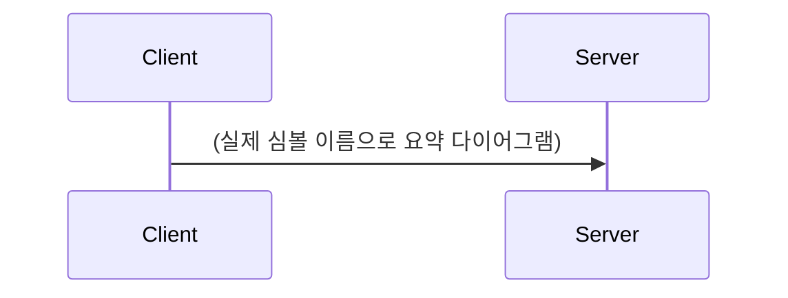

# (흐름 이름) — 예: 요청 처리 수명주기

> 독자 기준: 온보딩 신입이 **코드를 열지 않고** 이 문서만으로 흐름을
> 따라갈 수 있어야 한다. 단계 나열만 하지 말고 왜/무엇/데이터 변화를 설명할 것.

## 한눈에 보기

## 시작점

- ✅ (엔트리포인트. main, IDL 인터페이스 메서드, CLI 명령 등)[^entry]

## 단계

(호출 순서대로. 각 단계 = 무슨 일이/왜/데이터가 어떻게. 코드 복사 금지.
 주장 하나에 근거 하나 — 사실과 추론이 섞이면 문장을 쪼갠다.)

- ✅ `A()` 가 요청을 받는다. 이 시점의 입력은 직렬화된 바이트이고 검증 전 상태다[^step_a]
- 🔍 검증을 여기서 하지 않는 이유는 ...로 보인다[^why_a]
- ✅ `B()` 로 넘긴다. 여기서 X가 Y 구조체로 변환된다[^step_b]
- 🔍 C는 콜백으로 호출되는 것으로 보인다[^why_c]

[^entry]: `경로:줄`
[^step_a]: `경로#A`
[^why_a]: 추론의 근거를 적는다 — `경로:줄`
[^step_b]: `경로:줄`
[^why_c]: 추론의 근거를 적는다 (기계 색인은 콜백을 못 잇는다)

## 언어 경계

(C++ ↔ Python ↔ IDL 생성 코드 사이를 넘는 지점이 있으면 반드시 기록.
이 경계는 기계 색인이 잇지 못하므로 여기 프로즈가 유일한 기록이다.)

## 실패 경로

(에러가 나면 어디서 어떻게 처리되는지. 모르면 unknown으로.)
